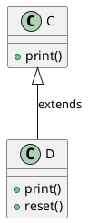

## Casting e polimorfismo

Il casting è un'operazione che consente di convertire un oggetto da un tipo a un altro. In Java, il casting è particolarmente utile quando si lavora con il polimorfismo, poiché permette di trattare un oggetto generico (ad esempio, tramite una superclasse o un'interfaccia) come un'istanza di una classe specifica per accedere a metodi o proprietà non disponibili nel tipo generico.

In questa sezione, approfondiremo quando è utile il casting , fornendo ulteriori esempi pratici e spiegando come evitare errori comuni.


### **Esempio di polimorfismo e casting**

Ipotizziamo che ci sia una gerarchia di classi simile a questa:

```java
// Classe astratta o superclasse
abstract class Animale {
    private String nome;

    public Animale(String nome) {
        this.nome = nome;
    }

    public String getNome() {
        return nome;
    }

    abstract void verso(); // Metodo astratto
}

// Sottoclasse concreta
class Cane extends Animale {
    public Cane(String nome) {
        super(nome); // Chiama il costruttore della superclasse
    }

    @Override
    void verso() {
        System.out.println(getNome() + " dice: Bau bau!");
    }
}
```

- `Animale` è una classe astratta (o potrebbe essere una classe normale) che definisce un comportamento generico per tutti gli animali.
- `Cane` è una sottoclasse concreta che estende `Animale` e fornisce un'implementazione specifica del metodo astratto `verso()`.

---

### **2. Analisi del Codice**

```java
Animale bobby = new Cane("Bobby");
Cane gigi = new Cane("Gigi");
```

#### **Riga 1: `Animale bobby = new Cane("Bobby");`**

- **Cosa fa?**
  - Qui viene creato un oggetto di tipo `Cane` con il nome `"Bobby"`.
  - Tuttavia, l'oggetto viene assegnato a un riferimento di tipo `Animale`.

- **Perché funziona?**
  - Questo è possibile grazie al **polimorfismo**. In Java, un riferimento di una superclasse può puntare a un oggetto di una sottoclasse. In altre parole, un oggetto di tipo `Cane` può essere trattato come un oggetto di tipo `Animale`.

- **Comportamento:**
  - Attraverso il riferimento `bobby`, puoi accedere solo ai metodi definiti nella classe `Animale` (o eventualmente sovrascritti in `Cane`). Non puoi accedere direttamente ai metodi specifici di `Cane` senza un casting esplicito.

- **Esempio:**
  ```java
  bobby.verso(); // Stampa: "Bobby dice: Bau bau!"
  System.out.println(bobby.getNome()); // Stampa: "Bobby"
  ```

---

#### **Riga 2: `Cane gigi = new Cane("Gigi");`**

- **Cosa fa?**
  - Qui viene creato un oggetto di tipo `Cane` con il nome `"Gigi"`.
  - L'oggetto viene assegnato a un riferimento di tipo `Cane`.

- **Perché funziona?**
  - In questo caso, il riferimento `gigi` è dello stesso tipo dell'oggetto (`Cane`). Non c'è polimorfismo coinvolto qui.

- **Comportamento:**
  - Attraverso il riferimento `gigi`, puoi accedere a tutti i metodi della classe `Cane`, inclusi quelli ereditati da `Animale` e quelli specifici di `Cane`.

- **Esempio:**
  ```java
  gigi.verso(); // Stampa: "Gigi dice: Bau bau!"
  System.out.println(gigi.getNome()); // Stampa: "Gigi"
  ```

---

### **3. Differenza tra `bobby` e `gigi`**

| **Aspetto**              | **`bobby` (`Animale bobby = new Cane("Bobby")`)** | **`gigi` (`Cane gigi = new Cane("Gigi")`)** |
|--------------------------|--------------------------------------------------|---------------------------------------------|
| **Tipo del Riferimento** | `Animale`                                       | `Cane`                                     |
| **Tipo dell'Oggetto**    | `Cane`                                          | `Cane`                                     |
| **Metodi Accessibili**   | Solo i metodi definiti in `Animale` (o sovrascritti in `Cane`) | Tutti i metodi di `Cane` e quelli ereditati da `Animale` |
| **Polimorfismo**         | Sì                                              | No                                         |

---

### **4. Perché Usare Polimorfismo?**

Il polimorfismo è utile quando vuoi scrivere codice generico che funzioni con oggetti di diverse classi, purché queste appartengano alla stessa gerarchia di ereditarietà. Ad esempio:

```java
public class TestPolimorfismo {
    public static void main(String[] args) {
        Animale bobby = new Cane("Bobby");
        Animale micio = new Gatto("Micio");

        faiVerso(bobby); // Stampa: "Bobby dice: Bau bau!"
        faiVerso(micio); // Stampa: "Micio dice: Miao miao!"
    }

    public static void faiVerso(Animale animale) {
        animale.verso();
    }
}
```

- **Analisi:**
  - Il metodo `faiVerso` accetta un parametro di tipo `Animale`.
  - Può lavorare con qualsiasi oggetto che sia un'istanza di una sottoclasse di `Animale` (ad esempio, `Cane` o `Gatto`).
  - Il metodo corretto (`verso()`) viene determinato dinamicamente durante l'esecuzione, in base al tipo effettivo dell'oggetto.

---

### **5. Quando Usare Casting?**

Se vuoi accedere a metodi specifici di `Cane` attraverso il riferimento `bobby` (che è di tipo `Animale`), devi eseguire un **casting esplicito**:

```java
if (bobby instanceof Cane) {
    Cane cane = (Cane) bobby; // Casting esplicito
    cane.metodoSpecificoDiCane(); // Accede a un metodo specifico di Cane
}
```

---

### **Conclusione**

- `Animale bobby = new Cane("Bobby");` dimostra il **polimorfismo**, dove un oggetto di tipo `Cane` viene trattato come un oggetto di tipo `Animale`.
- `Cane gigi = new Cane("Gigi");` è un'assegnazione diretta, senza polimorfismo.
- Il polimorfismo consente di scrivere codice flessibile e riutilizzabile, mentre il casting permette di accedere a metodi specifici di una sottoclasse quando necessario.

---

### **Esempio di polimorfismo**



```plaintext
+----------------+
|       C        |
+----------------+
| +print()       |
+----------------+
          ^
          |
     extends
          |
          v
+----------------+
|       D        |
+----------------+
| +print()       |
| +reset()       |
+----------------+
```

Per completare l'esempio, ecco il codice Java corrispondente:

```java
// Classe C
class C {
    void print() {
        System.out.println("Metodo print() di C");
    }
}

// Classe D che estende C
class D extends C {
    @Override
    void print() {
        System.out.println("Metodo print() di D");
    }

    void reset() {
        System.out.println("Metodo reset() di D");
    }
}

public class TestPolimorfismo {
    public static void main(String[] args) {
        C v1 = new C();
        C v2 = new D();
        D v3 = new D();

        v1.print(); // Chiama print() di C
        v2.print(); // Chiama print() di D grazie al polimorfismo

        // v2.reset(); // Errore: reset() non è definito in C

        v3.print(); // Chiama print() di D
        v3.reset(); // Chiama reset() di D
    }
}
```

Il diagramma mostra una gerarchia di classi con due classi: `C` e `D`.

- **Classe `C`:**
  - Contiene un metodo `print()`.
  - È la superclasse della classe `D`.

- **Classe `D`:**
  - Estende la classe `C`.
  - Contiene i metodi `print()` e `reset()`.

---

### **2. Creazione degli Oggetti**

Sono state create tre variabili:
- `v1` è un oggetto di tipo `C` (istanza di `C`).
- `v2` è un oggetto di tipo `C` ma punta a un'istanza di `D`.
- `v3` è un oggetto di tipo `D` (istanza di `D`).

```java
C v1 = new C(); // Istanza di C
C v2 = new D(); // Istanza di D, ma riferimento di tipo C
D v3 = new D(); // Istanza di D
```

---

### **3. Chiamate ai Metodi**

#### **Chiamata a `print()`**

- **`v1.print()`:**  
  - `v1` è un'istanza di `C`, quindi viene chiamato il metodo `print()` definito in `C`.
  - Output: "Metodo print() di C"

- **`v2.print()`:**  
  - Anche se `v2` ha un riferimento di tipo `C`, punta a un'istanza di `D`. Grazie al polimorfismo, viene chiamato il metodo `print()` sovrascritto in `D`.
  - Output: "Metodo print() di D"

#### **Chiamata a `reset()`**

- **`v2.reset()`:**  
  - Non funziona perché `v2` ha un riferimento di tipo `C`, che non contiene il metodo `reset()`. Ciò genera un errore di compilazione.
  - Errore: `The method reset() is undefined for the type C`

- **`v3.reset()`:**  
  - `v3` è un'istanza di `D`, quindi può accedere direttamente al metodo `reset()` definito in `D`.
  - Output: "Metodo reset() di D"

---

### **4. Analisi del Polimorfismo**

Questo esempio dimostra come il polimorfismo permette di trattare oggetti di diverse classi attraverso un riferimento comune. In particolare:

- **Overriding:** Il metodo `print()` in `D` sovrascrive quello in `C`, consentendo comportamenti diversi per istanze di `D` anche quando sono trattate come istanze di `C`.
- **Riferimenti Polimorfici:** Un riferimento di tipo superclasse (`C`) può puntare a un'istanza di una sottoclasse (`D`), ma solo i metodi definiti nella superclasse sono accessibili senza casting.

---

### **6. Conclusione**

Questo esempio illustra come il polimorfismo permette di scrivere codice flessibile e riutilizzabile, dove gli oggetti possono essere trattati attraverso riferimenti di tipo superclasse. Tuttavia, è importante notare che solo i metodi definiti nella superclasse sono accessibili senza casting, a meno che non si utilizzi un riferimento specifico della sottoclasse.

---

**Esercizi Pratici:**
1. Modifica l'esempio per aggiungere un metodo `info()` in `C` e `D` e osserva il comportamento del polimorfismo.
2. Implementa un metodo `display()` in `C` e `D` che stampi informazioni specifiche di ciascuna classe e verifica il comportamento del polimorfismo.
3. Crea un nuovo metodo in `D` e prova ad accedervi attraverso un riferimento di tipo `C` per verificare l'errore di compilazione.
