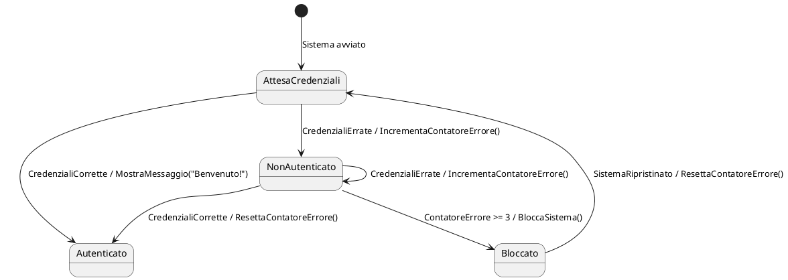

### **1.3 Diagrammi di stato**

I **diagrammi di stato** (o diagrammi di macchine a stati) sono rappresentazioni grafiche utilizzate per descrivere il comportamento di un sistema in termini di stati, transizioni ed eventi. Sono uno strumento fondamentale per la progettazione e l'analisi delle macchine a stati finiti (FSM), poiché permettono di visualizzare chiaramente le relazioni tra gli stati e le condizioni che causano le transizioni.

---

#### **Elementi principali di un diagramma di stato**

Un diagramma di stato è composto dai seguenti elementi:

1. **Stati:**
   - Rappresentati da ovali o rettangoli arrotondati.
   - Ogni stato ha un nome descrittivo che indica la condizione corrente del sistema.
   - Esempio: `Acceso`, `Spento`, `InAttesa`.

2. **Transizioni:**
   - Rappresentate da frecce che connettono due stati.
   - Le frecce indicano la direzione del passaggio da uno stato all'altro.
   - Ogni transizione è etichettata con l'evento che la scatena.
   - Esempio: `PulsantePremuto` o `TimerScaduto`.

3. **Eventi:**
   - Gli eventi sono i segnali o le condizioni che attivano una transizione.
   - Vengono solitamente scritti come etichette sulle frecce delle transizioni.
   - Esempio: `TemperaturaAlta`, `ComandoRicevuto`.

4. **Azioni:**
   - Le azioni possono essere associate a transizioni o a stati.
   - Quando un'azione è associata a una transizione, viene eseguita durante il passaggio da uno stato all'altro.
   - Quando un'azione è associata a uno stato, può essere eseguita all'ingresso (`entry`), all'uscita (`exit`) o durante la permanenza nello stato (`do`).
   - Esempio: `/AccendiLuce`, `/SpegniLuce`.

5. **Stato iniziale:**
   - Rappresentato da un cerchio pieno con una freccia puntata verso lo stato iniziale del sistema.
   - Indica lo stato in cui il sistema si trova all'avvio.

6. **Stato finale:**
   - Rappresentato da un cerchio pieno all'interno di un cerchio vuoto.
   - Indica lo stato finale del sistema, se presente.

---

#### **Notazione UML per i diagrammi di stato**

La notazione UML (Unified Modeling Language) è comunemente usata per disegnare diagrammi di stato. Di seguito sono riportati alcuni simboli e convenzioni tipici:

- **Stato:**  
  Un rettangolo arrotondato con il nome dello stato al suo interno.  
  Esempio:  
  ```
  +----------------+
  |    Acceso      |
  +----------------+
  ```

- **Transizione:**  
  Una freccia che connette due stati, con l'evento e l'azione opzionale scritti sopra.  
  Esempio:  
  ```
  [StatoCorrente] --(Evento)/Azione--> [StatoSuccessivo]
  ```

- **Stato iniziale:**  
  Un cerchio pieno con una freccia diretta verso lo stato iniziale.  
  Esempio:  
  ```
  ● --> [StatoIniziale]
  ```

- **Stato finale:**  
  Un cerchio pieno all'interno di un cerchio vuoto.  
  Esempio:  
  ```
  [StatoFinale] --> ○●
  ```

---

#### **Esempio di diagramma di stato**

Consideriamo un sistema semplice: un timer digitale con tre stati (`Attivo`, `Pausa`, `Stop`). Il diagramma di stato potrebbe essere rappresentato come segue:

```
         +-----------+        +----------+
         |           |        |          |
●------->|   Stop    |<-------|  Pausa   |
         |           |        |          |
         +-----^-----+        +----^------+
               |                     |
               |                     |
     (Avvia)   v              (Riprendi)
               |                     |
               |                     |
         +-----v-----+        +------v------+
         |           |        |             |
         |  Attivo   |-------->   Pausa     |
         |           |        |             |
         +-----------+        +-------------+
```

**Descrizione del diagramma:**
- Lo stato iniziale è `Stop`.
- Dall'evento `Avvia`, il sistema passa allo stato `Attivo`.
- Dall'evento `Pausa`, il sistema passa allo stato `Pausa`.
- Dall'evento `Riprendi`, il sistema ritorna allo stato `Attivo`.
- Dall'evento `Stop`, il sistema ritorna allo stato iniziale `Stop`.

---

### **Esempio con PlantUML: Diagramma di Stato Completo**

PlantUML è uno strumento open-source che consente di creare diagrammi UML (compresi i diagrammi di stato) utilizzando una sintassi testuale semplice. Di seguito, vediamo un esempio completo in cui sono chiaramente identificati gli **stati**, le **transizioni**, gli **eventi** e le **azioni**.

---

#### **Caso d'uso: Sistema di Autenticazione Utente**

Immaginiamo di voler modellare un sistema di autenticazione utente con i seguenti requisiti:
- Lo stato iniziale è `AttesaCredenziali`.
- Se l'utente inserisce credenziali corrette, il sistema passa allo stato `Autenticato`.
- Se le credenziali sono errate, il sistema rimane nello stato `NonAutenticato` per un numero massimo di tentativi.
- Dopo tre tentativi falliti, il sistema passa allo stato `Bloccato`.

Ogni transizione include azioni specifiche, come visualizzare messaggi o registrare eventi.

---

#### **Diagramma di Stato in PlantUML**

Di seguito è riportata la sintassi PlantUML per rappresentare il sistema descritto:



---

#### **Spiegazione del Diagramma**

1. **Stati:**
   - `AttesaCredenziali`: Lo stato iniziale in cui il sistema attende l'inserimento delle credenziali.
   - `Autenticato`: Lo stato raggiunto quando le credenziali sono state verificate con successo.
   - `NonAutenticato`: Lo stato raggiunto quando le credenziali sono errate.
   - `Bloccato`: Lo stato raggiunto dopo tre tentativi falliti consecutivi.

2. **Transizioni:**
   - Da `AttesaCredenziali` a `Autenticato`: Avviene quando vengono fornite credenziali corrette.
   - Da `AttesaCredenziali` a `NonAutenticato`: Avviene quando vengono fornite credenziali errate.
   - Da `NonAutenticato` a `Autenticato`: Avviene quando vengono fornite credenziali corrette dopo un tentativo fallito.
   - Da `NonAutenticato` a `Bloccato`: Avviene quando il contatore di errori raggiunge o supera 3.

3. **Eventi:**
   - `CredenzialiCorrette`: Evento generato quando le credenziali inserite sono valide.
   - `CredenzialiErrate`: Evento generato quando le credenziali inserite sono errate.
   - `ContatoreErrore >= 3`: Condizione che scatena la transizione verso lo stato `Bloccato`.
   - `SistemaRipristinato`: Evento che consente di sbloccare il sistema.

4. **Azioni:**
   - `/MostraMessaggio("Benvenuto!")`: Azione eseguita durante la transizione verso lo stato `Autenticato`.
   - `/IncrementaContatoreErrore()`: Azione eseguita durante la transizione verso lo stato `NonAutenticato`.
   - `/ResettaContatoreErrore()`: Azione eseguita durante la transizione verso lo stato `Autenticato` o `AttesaCredenziali`.
   - `/BloccaSistema()`: Azione eseguita durante la transizione verso lo stato `Bloccato`.

---

#### **Visualizzazione del Diagramma**

Se si copia e incolla il codice sopra in un editor PlantUML (come [https://www.planttext.com/](https://www.planttext.com/)), si otterrà un diagramma simile al seguente:


---

#### **Conclusioni**

Questo esempio dimostra come PlantUML possa essere utilizzato per modellare in modo chiaro e conciso un sistema basato su macchine a stati. La combinazione di diagrammi e codice permette di progettare sistemi embedded complessi in modo ordinato e strutturato. Nel prossimo capitolo, approfondiremo ulteriormente l'implementazione di FSM in C++, introducendo tecniche avanzate per la gestione della memoria e delle prestazioni.

---
#### **Conclusioni**

I diagrammi di stato sono uno strumento essenziale per modellare il comportamento di un sistema basato su macchine a stati. Consentono di visualizzare chiaramente le relazioni tra gli stati, le transizioni ed eventi, facilitando la progettazione e l'implementazione del sistema. Nel prossimo capitolo, vedremo come estendere questo concetto alle macchine a stati gerarchiche, per affrontare sistemi più complessi.